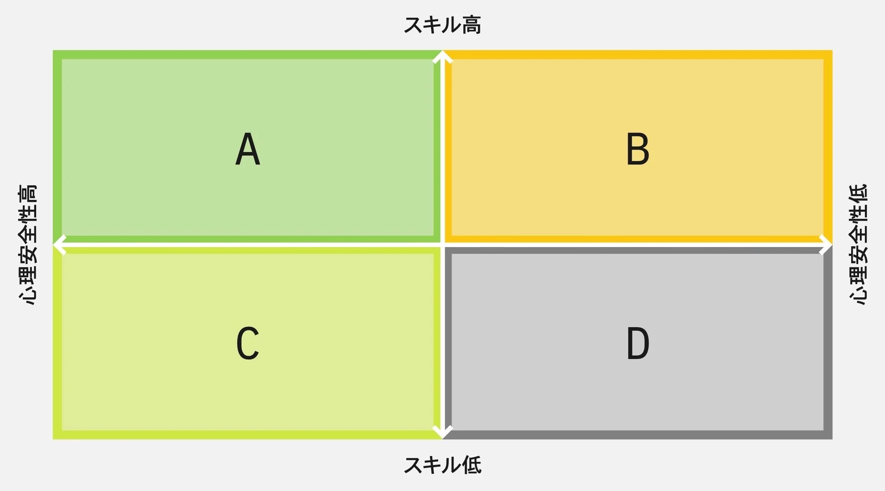

---

# 心理的安全性について考えてみた

2026/05/20 青木

---

### 心理的安全性とは

> 心理的安全性（psychological safety）とは、自分の意見や気持ちを安心して表現できる状態のことです。
> ビジネスシーンにおいては、上司や同僚に異なる意見を言ったとしても、人間関係が破綻したり、相手から拒絶されたりしないと感じる状態を指します。

https://www.nec-solutioninnovators.co.jp/sp/contents/column/20230609_psychological-safety.html#anc-1

---

### 心理的安全性が高い状態を作るには

- 心理的安全性を体験できる仕組みを作る
- 特定の人に偏らず発言できるようにする
- 何のために発言するのか共通した価値観を持つ
- アサーティブコミュニケーションを心がける
  - アサーティブコミュニケーション:相手を尊重しながら対等に自分の要望や感情を伝えるコミュニケーション方法
- 飲み会や食事会を実施する

https://www.recruit-ms.co.jp/glossary/dtl/0000000230/

<!--
心理的安全性を体験できる仕組み：1on1,Unipos
共通した価値観：この発言は何のためにしているのかという価値観
良い商品を作るために発言しているなどの共通の価値観
-->

---

### 心理的安全性が低い時に生まれる不安

- 「無知だ」と思われることへの不安
- 「無能だ」と思われることの不安
- 「邪魔だ」と思われることの不安
- 「ネガティブだ」と思われることの不安

https://www.nec-solutioninnovators.co.jp/sp/contents/column/20230609_psychological-safety.html#anc-1

---

### Uniposではどういった効果が得られるのか

心理的安全性に焦点を当てると

- チーム間でのコミュニケーションの活性化
- 周りに認められる安心感

---

### 心理的安全性が高いUnipos

文章の要素

- 相手への尊敬をしつつ、自分の感情や要望を伝える
- 共通した価値観を提示する
- 周りに認められていると思えるような文章

<!---->

---

## エンジニアの心理的安全性はどのように高くなるのか

https://zenn.dev/mirko_san/articles/915a91ad61f9b1

---

### 心理的安全性の４象限

---

### 各象限についての説明

- A: 一番ビジネス的に価値があるメンバー。スキルが高く、心理的安全性も高いので率直な対話が出来る。
- B: スキルがあるため貢献はするが、心理的安全性が低いため消極的。スキルを能動的に発揮せず、受動的。
- C: スキル面は発展途上だが、業務に必要なことを質問したり、ミスを隠蔽せずオープン。
- D: スキル面が発展途上かつ、対人リスクを恐れている。

---

### 各象限が理想的なAに近づくには

- B: スキルはあるので、対人リスクはとれる素地はあるはず。能動的に行動したら評価されるなどの行動へのインセンティブが必要そう。
- C: スキルを伸ばすことが優先。スキルを伸ばす過程で心理的安全性が損なわれないよう注意が必要。
- D: 心理的安全性の向上を優先。「無知」「無能」と思われない環境が必要。（スキルの向上はその後でも良い）
